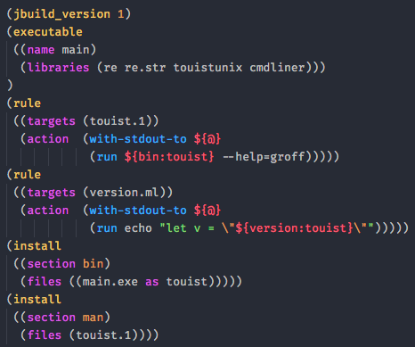

Dune for vscode
===============

Syntax coloring and linting for Dune/Jbuilder files in vscode.

This tmLanguage could also be used in other editors (textmate, sublime text) but
I didn't write a package/extension specifically for them; feel free to pick the
tmLanguage for any other editor! Github source [is here][github].

## Contribute

If you to fix the syntax file `Dune.tmLanguage`, you can use the
`Dune.YAML-tmLanguage` file to do so and then go into `build` and run

    npm install
    npm start

to compile yaml into tmLanguage. The JSON-tmLanguage is also generated in
case it can help for adding syntax support to an other editor.

To debug the syntax highlighting, you can use the command
**Developer Tools: Inspect TM Tokens**.

[github]: https://github.com/maelvalais/vscode-dune